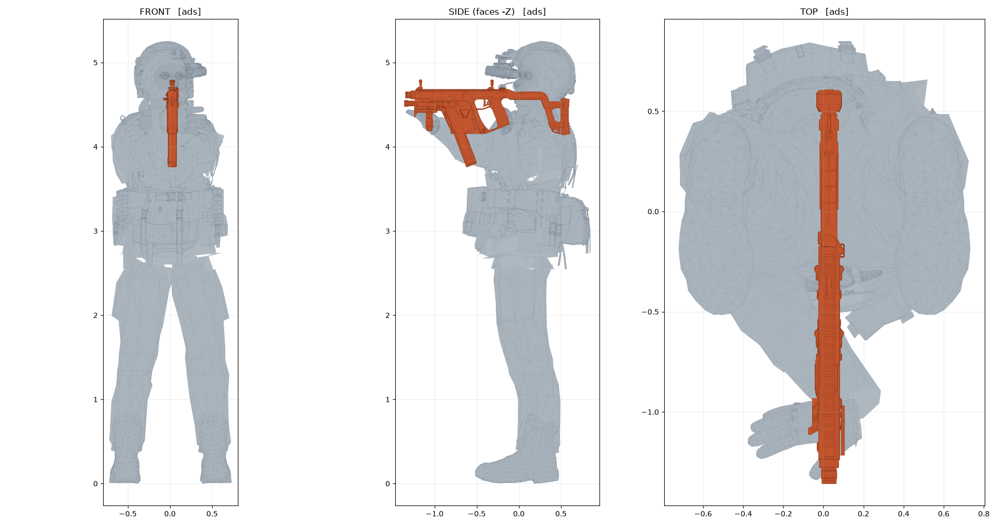

# BLACKSITE — real human body instead of R15

The soldier no longer uses R15's joint layout. It uses the actual bind pose of
the SWAT operator model: **21 animated bones including two clavicles, a
two-segment spine and toes**, none of which R15 has. Those three are most of why
an R15 character holding a rifle reads as a doll holding a prop — the shoulders
can't roll into the gun, the back can't round over it, and the feet can't roll
through a step.

The invisible R15 rig is still there and still comes first: it is posed, then
evaluated forward into `rig.poseWorld`, and the camera and the weapon are placed
from that. The operator body reads that finished pose and retargets it onto its
own skeleton. It is a *consumer* of the pose, never the producer.

That direction matters, and getting it backwards is what broke V36. Two things
go wrong the moment the human rig drives and R15 follows:

- `getChestCF` has to answer with **this** frame's pose. Roblox does not
  guarantee `Part.CFrame` reflects a `Motor6D.Transform` written earlier in the
  same render step — which is the whole reason `poseWorld` exists. The weapon is
  placed from `chestCF`, so a stale chest is a moved gun.
- the slaving pass laid `UpperTorso` along `Spine1 → Neck` measured *downward*,
  so the chest frame came back inverted even once it did settle.

Both are fixed by leaving the R15 path exactly as it was and hanging the body off
the end of it. Every hook into it is `pcall`-guarded and falls back to the old
procedural shell, so a fault in the new body can never take the camera or the
weapon down with it.

Open `place/Blacksite.rbxlx` in Studio and press play. It works with no setup —
but read *Getting the real body in* below, because one import makes it much
better.



---

## The three things you asked for

### 1. A realistic human body instead of R15

`HumanRig.lua` drives the real skeleton, measured out of your FBX by
`tools/convert_soldier.py`, with real bone lengths — 0.68 stud humerus, 0.61
forearm, 1.24 femur — rather than R15 proportions.

The body is **fitted to the R15 rig, not the other way round**. Growing the rig
to match the model moves the camera and the weapon with it, because every
constant in `GameConfig` — eye height, `CHEST_TO_SHOULDER`, the free-aim pivot —
is tuned against the rig as it is. So `HeightScale` stays at 1.00 and the model
is sized to it, measured at spawn from the actual character.

Two scales, not one: R15 carries its hips at about 60% of standing height and a
human carries them at 52%. Fit the legs with a single number and the head lands
half a stud above the camera; fit the head and the feet leave the floor. The leg
chain is fitted to the rig's pelvis height and the spine chain to its
pelvis-to-head span, which lands both — hips exactly on the R15 pelvis, head
within 0.015 studs, feet on the ground.

### 2. Animations

The gait itself still comes from where it always did — the R15 solve in
`SoldierVisual.poseBody` — and `OperatorShell` retargets it onto the operator
using joint **positions** only: for each bone, the direction from one R15 part to
the next, with the bind direction swung onto it. Positions carry no convention,
so it does not matter that R15 limb parts point +Y back up toward their parent
while Mixamo bones point +Y down toward their child. Bone lengths stay the
operator's own, so the body keeps human proportions instead of being stretched
onto R15's.

The bones R15 **doesn't have** — both clavicles, the second spine segment, the
toes — have nothing to retarget from, so they keep the procedural values
`HumanPose.lua` gives them, tuned from `GameConfig.HUMAN_ANIM` and authored in
character space (+X right, +Y up, +Z back) via `HumanRig.anatomical`. That is the
whole reason those bones are worth having, and it costs nothing:

What they buy:

- **Clavicles** — both shoulders roll forward and shrug up as the rifle comes to
  the eye; the firing side pulls back to seat the stock.
- **Two-segment spine** — the chest rounds over the weapon instead of the whole
  trunk hinging at one waist joint. Lean and recoil distribute across both.
- **Toes** — the trailing foot rolls over the ball at push-off, the swinging foot
  dorsiflexes so it clears and lands heel-first. This is most of what makes a
  walk look weighted rather than skated.

The gait is phase-driven rather than baked, so it stays continuous while you
change speed, direction and stance mid-step, and stays in sync with the weapon
animation, which is also phase-driven. `OperatorShell` shares the R15 body's gait
clock, so the toes roll on the step the legs are actually taking.

### 3. Arms that actually hold the gun

This is solved from both ends rather than authored, in `HumanArms.lua`:

- the **weapon** supplies a grip frame, measured off the geometry of the pistol
  grip and foregrip;
- the **hand** supplies a palm frame, measured off the knuckle bones of the rig;
- the wrist goes where those two frames coincide:
  `wrist = weaponCF * weaponGrip * palm:Inverse()`

Because both carry a full orientation and not just a point, the fingers close
*along* the grip instead of through it. A two-bone solve then places the elbow,
with poles that drop the support elbow under the handguard and tuck the firing
elbow into the ribs when braced.

Your existing weapons (MK18, M870, P320) keep working: `WeaponGrips.lua` derives
the same kind of frame from each weapon's own part list — a pistol grip is a long
box tilted back a few degrees, and its long axis is enough to build the frame. No
per-weapon rotations to hand-tune.

**Verified, not guessed.** `tools/preview_pose.py` runs the identical
construction in numpy and renders it (that's the image above). Palm-to-grip error
is `0.0000`, and `tools/verify_data.py` re-checks the shipped Luau numbers:
round-trip error ~1e-16.

---

## Getting the real body in (recommended, ~2 minutes)

Out of the box the body is rebuilt at run time from geometry embedded in
`SoldierRigData.lua` as one rigid MeshPart per bone. That works with zero setup,
but rigid chunks can't deform, so joints overlap rather than bend, and there are
no textures.

Importing the FBX once gives you true skinning and your Sketchfab textures:

1. In Studio: **Avatar → 3D Importer**, choose `assets/swat_operator.fbx`.
2. Leave rigging enabled — the `mixamorig:*` bones must come through.
3. Drag the imported model into `ReplicatedStorage/CharacterModels` and name it
   **`SwatOperator`**.
4. Download the textures from https://skfb.ly/oATOX, upload them, and apply them
   as a `SurfaceAppearance` on the imported MeshPart.

`HumanRig` detects the bones by name and switches to writing `Bone.Transform`, so
Roblox does real vertex skinning. Nothing else changes — same animation, same IK,
same grips.

Modes, best first: `skinned` (imported) → `mesh` (runtime-built) → `primitive`
(mesh APIs unavailable; sized blocks, still this soldier's proportions). The
current mode is on the character as the `BlacksiteVisualBody` attribute, and the
client prints it once on spawn:

```
[BLACKSITE] operator body: mode=mesh pieces=19
```

If you get `primitive` unexpectedly, turn on
**Experience Settings → Security → Allow Mesh & Image APIs**.

If you see no line at all, the operator body did not build and the old
procedural shell is running instead — that is the designed fallback, not a
crash. Any fault inside the new body warns once with what failed:

```
[BLACKSITE] operator body: pose failed -- ...
```

---

## Layout

```
place/Blacksite.rbxlx     the place — open this
src/                      every script in the place, extracted for review
assets/swat_operator.fbx  the source model
docs/                     rendered pose references
tools/                    the FBX → Luau pipeline
```

### New modules

| Module | What it does |
|---|---|
| `SoldierRigData` | *generated* — bind pose + per-bone geometry |
| `KSVRMesh` | *generated* — the FBX's rifle + measured grip frames |
| `HumanRig` | builds and drives the skeleton; three draw modes; fit-to-R15 scaling |
| `HumanPose` | locomotion and stance |
| `HumanArms` | two-bone IK onto the grips |
| `WeaponGrips` | derives grip frames for the procedural weapons |
| `OperatorShell` | retargets the R15 pose onto the operator, and draws it |

`SoldierVisual` keeps its V31 R15 pipeline unchanged and calls into
`OperatorShell` at four points, each `pcall`-guarded. Its public API is the same,
so `FPSClient` and `CharacterVisuals` needed only one line each — passing the
weapon CFrame that `VM.update` was already returning and discarding.

`CustomSoldierBuilder` / `CustomSoldierMesh` (the old procedural capsule body)
are left in place but nothing requires them any more. Safe to delete once you're
happy; keeping them makes rollback easy.

### Rebuilding

```bash
python3 tools/convert_soldier.py --tris 12000   # skeleton + body geometry
python3 tools/convert_weapon.py  --tris 5200    # rifle + grip anchors
python3 tools/check_luau.py 'src/**/*.lua'      # structural syntax check
python3 tools/verify_data.py                    # validate generated numbers
python3 tools/preview_pose.py --pose ads        # render the hold pose
python3 tools/pack.py                           # write src/ back into the place
```

Requires `numpy` and `matplotlib`. The FBX parser is pure stdlib.

---

## Tuning

Everything lives in `GameConfig`:

- `C.HUMAN_ANIM` — the new joints: clavicle roll/shrug, spine split, toe roll,
  crouch depth, elbow poles, eye offset.
- `C.SOLDIER_ANIM` — the existing gait constants, still used.

Two worth knowing:

- `POLE_SUPPORT` / `POLE_FIRING` decide where the elbows go. They change the
  read of the stance more than anything else in the file.
- `EYE_OFFSET` is where ADS aligns the sight line. It is offset to the dominant
  eye on purpose — the rifle comes to one eye and the head comes over the stock
  to meet it, not to the middle of the face.

---

## Licence

The character model is CC-BY and **requires visible in-game attribution**, and it
carries Sketchfab's NoAI tag. Read [`ATTRIBUTION.md`](ATTRIBUTION.md) before you
publish.
